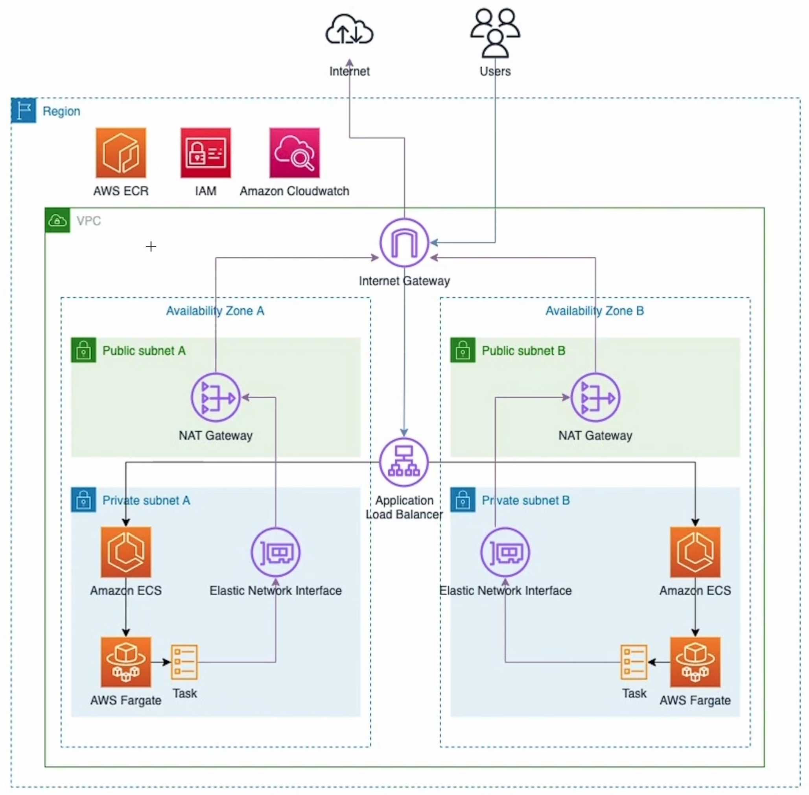
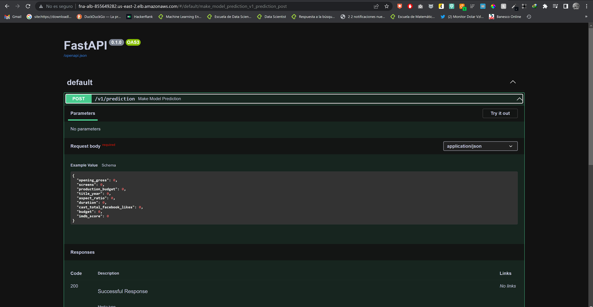

# FastAPI API to AWS ECS Fargate

## Application deployed [here](http://fna-alb-855649282.us-east-2.elb.amazonaws.com)

## Setup AWS Instance
* Sign up / create account at https://aws.amazon.com/
* Navigate to Services -> Elastic Container Service
  * Navigate to Repositories under ECR (Elastic Container Registry)
  * Create Repository
    * Click "View Push Commands" and use the commmands listed to build, tag, and push your image to the aws registry
* Navigate to Services -> Elastic Container Service
 * Navigate to Clusters under ECS (Elastic Container Service)
   * Create Cluster
* Navigate to Services -> Elastic Container Service
 * Navigate to Task Definitions under ECS (Elastic Container Service)
   * Create New Task Definition
     * EC2
     * Container Definitions (Add desired container that was uploaded)
      * Image should be the URI of the image we created earlier, but add ":github.sha" to fetch the latest image
      * Port Mappings: Map 80 (host) to 8000 (container); TCP
      * Entrypoint, Command, and Working directory should've been set in Dockerfile (need to research env variables)
* Navigate to Services -> Elastic Container Service
 * Navigate to Clusters under ECS (Elastic Container Service)
   * Cluster you created -> Tasks -> Run New Task -> Run Task
   * Cluster you created -> ECS Instances -> Click the EC2 Instance
   * Access service by grabbing the public DNS

## Continuous Deployment
Before starting workflow, navigate to the AWS console and stop the currently running container so that this workflow can work. We have to do this because dynamic port mapping needs to be configured in order to truly have continuous deployment. I use a load balancer, this option is recommended.

Explanations for this can be found here:

https://stackoverflow.com/questions/48931823/i-cant-deploy-a-new-container-to-my-ecs-cluster-because-of-ports-in-use

https://aws.amazon.com/premiumsupport/knowledge-center/dynamic-port-mapping-ecs/

## Resources Used
https://www.freecodecamp.org/news/how-to-deploy-a-node-js-application-to-amazon-web-services-using-docker-81c2a2d7225b/

https://www.youtube.com/watch?v=KJNj37ZXPqE&t=2360s

https://www.youtube.com/watch?v=9K3OEhm2lR0

## List create
https://www.youtube.com/watch?v=NF8iZp6rqps&list=PLWQmZVQayUUI5RinDqpoIXiRYWy5YZKjs&index=4